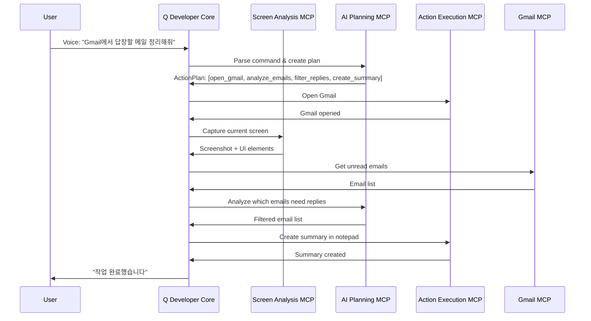

# Amazon Q Screen Automation Architecture

## 🏗️ System Overview

```
┌─────────────────────────────────────────────────────────────┐
│                    User Interface Layer                     │
├─────────────────────────────────────────────────────────────┤
│  Voice Input (Speech Framework) ←→ Q CLI ←→ Text Commands   │
└─────────────────────────────────────────────────────────────┘
                              ↓
┌─────────────────────────────────────────────────────────────┐
│                 Amazon Q Developer Core                     │
├─────────────────────────────────────────────────────────────┤
│  • Natural Language Processing                             │
│  • Command Parsing & Planning                              │
│  • MCP Server Orchestration                                │
│  • Context Management                                       │
└─────────────────────────────────────────────────────────────┘
                              ↓
┌─────────────────────────────────────────────────────────────┐
│                    MCP Server Layer                         │
├─────────────────────────────────────────────────────────────┤
│  Screen Analysis MCP  │  Action Execution MCP  │  AI Planning MCP │
│  App-Specific MCPs    │  AWS Integration MCP   │  Workflow MCP    │
└─────────────────────────────────────────────────────────────┘
                              ↓
┌─────────────────────────────────────────────────────────────┐
│                 Technology Integration Layer                │
├─────────────────────────────────────────────────────────────┤
│  macOS APIs          │  AWS Services          │  Local ML       │
│  • Accessibility API │  • Rekognition         │  • Vision        │
│  • IOKit             │  • Bedrock             │  • Core Graphics │
│  • AppleScript       │  • Textract            │  • Speech        │
└─────────────────────────────────────────────────────────────┘
```

## 🔧 Core MCP Servers

### 1. Screen Analysis MCP
**Purpose:** 화면 상태 분석 및 UI 요소 인식
```typescript
interface ScreenAnalysisMCP {
  tools: {
    capture_screenshot(): ImageData
    analyze_ui_elements(image: ImageData): UIElement[]
    extract_text(image: ImageData): TextRegion[]
    detect_clickable_areas(image: ImageData): ClickableArea[]
  }
}
```

### 2. Action Execution MCP  
**Purpose:** 실제 화면 조작 실행
```typescript
interface ActionExecutionMCP {
  tools: {
    click_element(coordinates: Point): boolean
    type_text(text: string, target?: Element): boolean
    scroll_page(direction: Direction, amount: number): boolean
    press_keys(keys: KeyCombination): boolean
  }
}
```

### 3. AI Planning MCP
**Purpose:** 복잡한 워크플로우 계획 및 의사결정
```typescript
interface AIPlanningMCP {
  tools: {
    analyze_screen_context(image: ImageData): ScreenContext
    plan_workflow(goal: string, context: ScreenContext): ActionPlan
    suggest_next_step(current_state: State): Suggestion
    handle_error(error: Error, context: Context): RecoveryPlan
  }
}
```

### 4. App-Specific MCPs
**Purpose:** 특정 앱에 최적화된 기능 제공
```typescript
interface GmailMCP {
  tools: {
    get_unread_emails(since?: Date): Email[]
    send_email(to: string, subject: string, body: string): boolean
    mark_as_read(emailIds: string[]): boolean
    search_emails(query: string): Email[]
  }
}

interface SlackMCP {
  tools: {
    send_message(channel: string, message: string): boolean
    get_channels(): Channel[]
    search_users(name: string): User[]
    upload_file(channel: string, file: File): boolean
  }
}
```

## 🔄 Execution Flow

### Example: "Gmail에서 답장할 메일 정리해줘"



## 🛠️ Development Structure

```
amazonq/
├── src/
│   ├── core/
│   │   ├── q_orchestrator.ts      # Main Q CLI integration
│   │   ├── command_parser.ts      # Natural language processing
│   │   ├── workflow_engine.ts     # Execution coordination
│   │   └── context_manager.ts     # State management
│   │
│   ├── mcp_servers/
│   │   ├── screen_analysis/
│   │   │   ├── server.ts
│   │   │   ├── rekognition_client.ts
│   │   │   └── vision_processor.ts
│   │   │
│   │   ├── action_execution/
│   │   │   ├── server.ts
│   │   │   ├── accessibility_controller.ts
│   │   │   └── iokit_wrapper.ts
│   │   │
│   │   ├── ai_planning/
│   │   │   ├── server.ts
│   │   │   ├── bedrock_client.ts
│   │   │   └── workflow_planner.ts
│   │   │
│   │   └── apps/
│   │       ├── gmail_mcp/
│   │       ├── slack_mcp/
│   │       ├── calendar_mcp/
│   │       └── excel_mcp/
│   │
│   ├── integrations/
│   │   ├── aws/
│   │   │   ├── rekognition.ts
│   │   │   ├── bedrock.ts
│   │   │   └── textract.ts
│   │   │
│   │   └── macos/
│   │       ├── accessibility.ts
│   │       ├── iokit.ts
│   │       ├── applescript.ts
│   │       └── speech.ts
│   │
│   └── types/
│       ├── ui_elements.ts
│       ├── workflows.ts
│       └── mcp_interfaces.ts
│
├── config/
│   ├── mcp_servers.json          # MCP server configurations
│   ├── app_mappings.json         # App-specific UI mappings
│   └── aws_config.json           # AWS service settings
│
├── scripts/
│   ├── setup_mcp_servers.sh      # MCP server installation
│   ├── install_dependencies.sh   # System dependencies
│   └── configure_permissions.sh  # macOS permissions setup
│
└── docs/
    ├── api_reference.md
    ├── mcp_development_guide.md
    └── troubleshooting.md
```

## 🚀 Key Implementation Points

### 1. Hybrid Approach
- **Fast Local Actions:** Accessibility API for immediate UI interactions
- **Intelligent Analysis:** AWS Rekognition for complex screen understanding  
- **Smart Planning:** Bedrock for workflow orchestration and decision making

### 2. MCP-First Architecture
- Each functionality is a separate MCP server
- Easy to extend with new apps and capabilities
- Community can contribute app-specific MCPs

### 3. Error Handling & Recovery
- Screenshot-based debugging when actions fail
- AI-powered error analysis and recovery suggestions
- Fallback mechanisms for different UI states

### 4. Privacy & Security
- Local processing for sensitive operations
- Configurable AWS region selection
- User consent for each automation step

## 📊 Success Metrics

- **Accuracy:** 85%+ successful task completion
- **Speed:** 70%+ faster than manual execution
- **Reliability:** 95%+ uptime for core functions
- **Extensibility:** New app support in <1 week development time

## 🎯 MVP Features

1. **Basic Screen Analysis:** Text recognition, clickable area detection
2. **Simple Actions:** Click, type, scroll, keyboard shortcuts
3. **Gmail Integration:** Read emails, compose replies, organize inbox
4. **Voice Commands:** Natural language input and audio feedback
5. **Error Recovery:** Basic retry mechanisms and user notifications

This architecture provides a solid foundation for building a comprehensive screen automation system that can evolve and scale with user needs.
